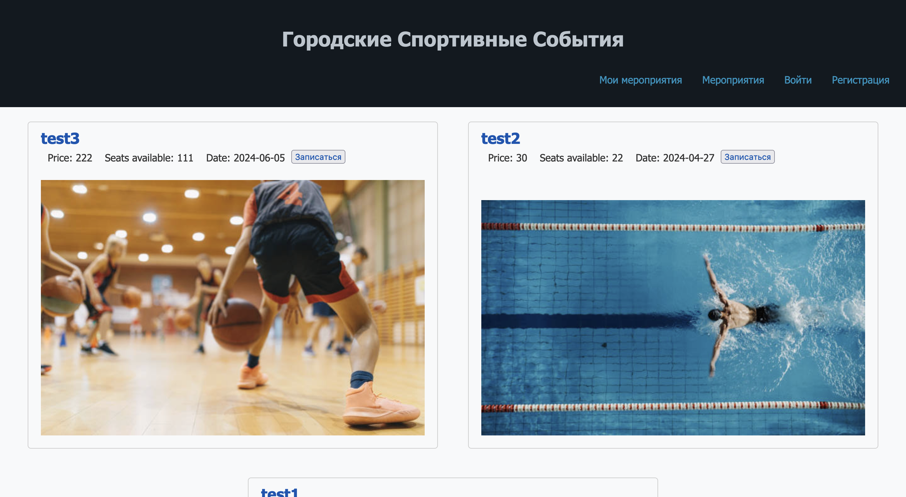

# Лабораторная работа №10. Взаимодействие с базой данных

### Задание 1. Создайте базу данных “event_platform”.


### Задание 2 и 3. Создайте следующие таблицы в базе данных и корректно установите между ними отношения.
2.1. `users`: пользователи (используется таблица с лабораторной работы №9).  
2.2. `events`: мероприятия  
`id`  
`name`: название мероприятия  
`price`: цена мероприятия  
`number_seats`: количество мест  
`date`: дата и время    
2.3. `event_records`: записи на мероприятие  
`id`  
`user_id`: id пользователя  
`event_id`: id мероприятия  
2.4. `roles`: роли (user / manager)  
`id`  
`name`: название роли    
Внесите изменения в таблицу пользователей, добавив поле role_id, 
содержащее идентификатор определенной роли.

```sql
CREATE TABLE event_records (
    id INTEGER PRIMARY KEY,
    user_id INTEGER,
    event_id INTEGER,
    FOREIGN KEY (user_id) REFERENCES users(id),
    FOREIGN KEY (event_id) REFERENCES events(id)
);

CREATE TABLE events (
    id INTEGER PRIMARY KEY,
    name TEXT,
    price REAL,
    number_seats INTEGER,
    date TEXT
, img TEXT);

CREATE TABLE roles (
    id INTEGER PRIMARY KEY,
    name TEXT
);

CREATE TABLE users (
    id INTEGER PRIMARY KEY,
    name TEXT,
    surname TEXT,
    email TEXT UNIQUE
, role_id INTEGER, password TEXT, token TEXT);
```

### Задание 4. Создайте четыре страницы:  
— Страница с текущими мероприятиями  

— Страница для записи на определенное мероприятие  

— Регистрация  

— Авторизация  


### Задание 5. Разработайте административную панель (доступную только пользователю с ID 'manager'), обладающую следующим функционалом:
— Добавление и изменение мероприятия  

— Просмотр зарегистрированных на мероприятие  

### Задание 6. Сохраняйте все необходимые данные в базе данных.
INSERT INTO "event_records" ("id", "user_id", "event_id") VALUES
('2', '4', '2'),
('3', '4', '1');

INSERT INTO "events" ("id", "name", "price", "number_seats", "date", "img") VALUES
('1', 'test1', '10.0', '10', '2024-04-16', 'istockphoto-949190756-612x612.jpg'),
('2', 'test2', '30.0', '22', '2024-04-27', 'istockphoto-1332857654-612x612.jpg'),
('3', 'test3', '222.0', '111', '2024-06-05', 'istockphoto-1347653184-612x612.jpg');

INSERT INTO "roles" ("id", "name") VALUES
('5', 'user'),
('777', 'manager');

INSERT INTO "users" ("id", "name", "surname", "email", "role_id", "password", "token") VALUES
('1', 'vasya', 'borov', 'vasya@mail.ru', '5', '$2y$10$XQbUWjJfRTVSx4qR6y.Ty.94La6hsBeQKO5ND6AXeqS5W3TV.5uhu', NULL),
('4', 'admin', 'admin', 'admin@mail.ru', '777', '$2y$10$jMVgvSEo/VMdMkyb7oTUQenwhv7fMp3IUOfA3Qhp7c/ZPB8k4hFIO', '06599d4b7e8aa0aaa7e179ad425fd218');

### Задание 8 (2 уровень сложности). Реализуйте систему аутентификации на основе токенов. В таблице users добавьте поле token, которое будет использоваться для хранения токенов пользователей:   
1. Когда пользователь входит в систему (например, вводит логин и пароль), сервер 
проверяет его учетные данные. Если они верны, сервер создает уникальный токен 
доступа. 
2. Клиент сохраняет полученный токен, обычно в localStorage или cookies браузера, 
чтобы иметь доступ к нему на протяжении сеанса работы.
3. Каждый раз, когда клиент отправляет запрос к защищенным ресурсам сервера, он 
должен включать токен в заголовке запроса или в другом безопасном месте.
4. Сервер получает запрос и проверяет переданный токен. Он проверяет, действителен 
ли токен и имеет ли он права доступа к запрашиваемому ресурсу.

```php
session_start();
$db = new PDO('sqlite:event_platform.db');

if ($_SERVER["REQUEST_METHOD"] == "POST") {
    $email = $_POST['email'];
    $password = $_POST['password'];

    // Проверка учетных данных
    $stmt = $db->prepare("SELECT id, password, token FROM users WHERE email = ?");
    $stmt->execute([$email]);
    $user = $stmt->fetch();

    if ($user && password_verify($password, $user['password'])) {
        // Генерация нового токена
        $token = bin2hex(random_bytes(16)); // Генерация безопасного токена

        // Сохранение токена в базе данных
        $update = $db->prepare("UPDATE users SET token = ? WHERE id = ?");
        $update->execute([$token, $user['id']]);

        // Установка токена в сессию или возврат клиенту
        $_SESSION['token'] = $token;
        // echo "Вы успешно авторизованы.";
        header("Location: index.php");
    } else {
        echo "Неверный логин или пароль.";
    }
}
```
Токен создается:

